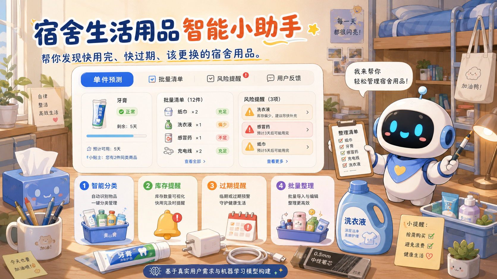

# 宿舍生活用品智能小助手

面向宿舍清单管理的中文 Streamlit 应用：自动识别物品类别，并结合使用频率、剩余量、有效期和破损状态，给出正常、关注、补货或过期/损坏风险建议。

[GitHub 仓库](https://github.com/BTspaceC/dormitory-item-assistant)



## 核心能力

- 单件预测：类别、风险、置信参考、预计剩余天数、原因和建议。
- 批量清单：在线编辑或上传 CSV / Excel，最多 500 行，支持结果导出。
- 混合决策：机器学习处理模糊边界，高精度领域规则处理明确类别、临期和低库存条件。
- 反馈闭环：反馈仅进入候选区，经人工复核后才能用于离线重训，不进行在线自动学习。
- 可复现评估：同时报告原模型、规则基线和优化方案，保留真实留出样本逐条结果。

## 模型与数据

| 任务 | 最终方案 | 训练数据 | 输出 |
|:---|:---|:---|:---|
| 类别识别 | 字符 `2-5 gram` + 中文词组 `1-2 gram` TF-IDF、特征筛选、逻辑回归、高精度领域规则 | 109 条本地复核样本 + 42,000 条外部商品类别训练样本 | 7 类物品 |
| 风险判断 | 随机森林 + 安全/补货决策门 | 109 条本地复核样本；外部数据不参与风险训练 | 4 类状态 |

外部数据来自 [JD dataset](https://gitee.com/KunLiu_kk/jd-dataset) 的固定版本 `2931aecb`。原始数据包含 101 万余条中文商品标题；本项目按现有 7 个类别进行保守映射、去重和均衡抽样，保留 42,000 条训练样本与 7,000 条独立外部留出样本。压缩后的派生数据位于 `data/external/jd_category_samples.csv.gz`。

外部商品数据只有类别信息，没有库存、有效期或破损标签，因此从未进入风险模型。来源和许可证见 [第三方声明](THIRD_PARTY_NOTICES.md)。

## 当前评估结果

| 评估内容 | 原方案 | 优化方案 |
|:---|---:|---:|
| 真实留出类别 Accuracy（10 条） | 1.000 | 1.000 |
| 外部留出类别 Accuracy（7,000 条） | 0.226 | **0.979** |
| 外部留出类别 Macro F1 | 0.173 | **0.979** |
| 真实留出风险 Accuracy（10 条） | 0.600 | **0.900** |
| 真实留出风险 Macro F1 | 0.517 | **0.889** |

完整定义、逐条预测和混淆矩阵见 [模型评估报告](reports/model_eval.md)。10 条真实风险留出样本仍然很少，因此风险结果只能作为回归证据，不能当作生产泛化承诺。

## 安装与运行

要求 Python 3.12 或兼容版本。

```bash
python -m pip install -r requirements.txt
python -m streamlit run app.py
```

开发模式：

```bash
python -m pip install -e .[dev]
python -m pytest tests
```

## 重新训练

仓库已包含脱敏本地数据和压缩后的外部类别样本：

```bash
python -m src.data_prepare
python -m src.train_models
```

若需要从已解压的 JD dataset 文本重新构建平衡样本：

```bash
python -m src.external_data path/to/sample_train.txt path/to/sample_test.txt
python -m src.train_models
```

`src.external_data` 使用确定性随机种子、全局标题去重、每类等量蓄水池抽样，并预先划分 `external_train` / `external_eval`，防止同一标题跨集合泄漏。

## 数据与反馈边界

- 原始访谈表中的姓名和联系方式不会进入训练集；仓库只保留脱敏版本。
- `label_source=rule_initial` 的样本会被训练脚本拒绝，规则输出不能伪装成人工标签。
- 用户反馈写入 `data/feedback/`，该目录不入 Git；运行 `python -m src.merge_feedback` 只能生成待复核候选样本。
- 外部数据许可为 MulanPSL-2.0；派生数据和模型使用时应保留第三方声明与许可证副本。

## 目录结构

```text
app.py                         Streamlit 入口
src/data_prepare.py            脱敏、清洗与本地训练集生成
src/external_data.py           京东类别映射、去重、平衡抽样
src/train_models.py            基线对照、模型训练与评估
src/predict.py                 类别与风险统一预测接口
src/features.py                特征解析、领域规则与混合决策
src/merge_feedback.py          用户反馈候选样本整理
data/external/                 压缩后的外部类别样本
data/processed/                本地训练集与真实留出集
models/                        已训练模型与元数据
reports/                       评估和测试记录
tests/                         自动化回归测试
```

## 局限性

- 京东商品标题与宿舍用品仍有领域差异；本地复核样本通过领域重采样和高精度关键词规则保持优先级。
- 外部类别评估集与训练集来自同一来源，0.979 不能直接等价为任意用户输入上的准确率。
- 风险样本规模仍小，混合决策的提升需要更多独立真实留出数据再次验证。
- 系统建议不能替代对药品有效期、电器破损和安全隐患的人工检查。

## AI 辅助开发声明

项目使用 AI 辅助方案讨论、代码和文档整理；数据边界、标签策略、评估口径及最终验收由开发者确认。详见 [AI 辅助开发记录](docs/ai_usage_record.md)。
